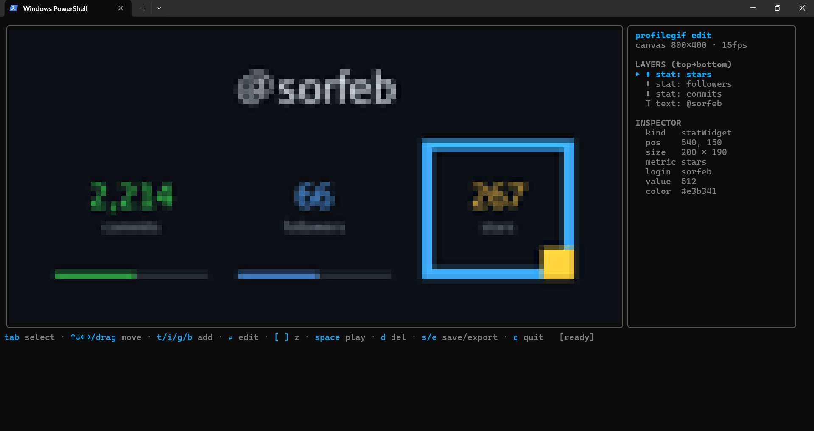

<div align="center">

# profilegif

**Animated GitHub-stats GIFs for your profile README — composed in an interactive terminal editor.**

One Go binary is both a web service *and* a mouse-driven TUI where you drag & resize elements
on a canvas. No Node, no separate frontend, deploys anywhere.




</div>

---

## Table of contents

- [What it does](#what-it-does)
- [Add it to your profile (GitHub Actions)](#add-it-to-your-profile-github-actions)
- [Quickstart (local)](#quickstart-local)
- [The editor](#the-editor)
- [The web service](#the-web-service)
- [Configuration](#configuration)
- [How it works](#how-it-works)
- [Contributing](#contributing)
- [License](#license)

## What it does

`profilegif` produces the animated stats card you drop into a GitHub profile README:


The default look is a **monochrome, terminal/ASCII card on a transparent background** — one
ink color, monospace, `[████░░░░]` meters — so it blends into your README in both light and
dark mode. And the interesting part is **how you build it**: lay the card out visually in your
terminal — drag widgets around, resize them, retype labels — then export or serve it.

- 🎯 **Blends with GitHub's theme** — transparent background + light/dark ink variants.
- 🖱️ **Drag & resize in the terminal** — a real editor, mouse and all, no browser.
- 🎨 **Hybrid canvas** — background image/GIF + GitHub-stat widgets + free text/image layers.
- ▶️ **Live animation preview** — watch counters tick and bars fill as you edit.
- 📦 **Single static binary** — pure Go, `CGO_ENABLED=0`, runs anywhere.

## Add it to your profile (GitHub Actions)

**The recommended way — no server to host.** A scheduled GitHub Action renders your GIF and
commits it to your repo; your README just points at the committed file.

Add `.github/workflows/profile.yml` to your **profile repo** (`github.com/<you>/<you>`):

```yaml
name: Update profile GIF
on:
  schedule: [{ cron: "0 0 * * *" }] # daily
  workflow_dispatch: {}
permissions:
  contents: write
jobs:
  profilegif:
    runs-on: ubuntu-latest
    steps:
      - uses: actions/checkout@v4
      - uses: sorfeb/profilegif@v1
        with:
          user: ${{ github.repository_owner }}
          theme: both # writes profile-dark.gif and profile-light.gif
      - run: |
          git config user.name github-actions[bot]
          git config user.email github-actions[bot]@users.noreply.github.com
          git add profile-dark.gif profile-light.gif
          git diff --staged --quiet || git commit -m "chore: refresh profile GIF"
          git push
```

Then in your README — GitHub shows the matching variant per theme:

```markdown


```

That's it — it refreshes daily and whenever you trigger it manually. A ready-to-copy version
lives in [`examples/profile.yml`](examples/profile.yml). If the default token can't read your
stats, pass a read-only PAT via `token: ${{ secrets.PROFILEGIF_TOKEN }}`.

## Quickstart (local)

Requires **Go 1.25+**.

```sh
git clone https://github.com/sorfeb/profilegif.git
cd profilegif

go run . edit                       # interactive editor (sample data — no token needed)
go run . render -user you -mock     # one-shot → profile-dark.gif + profile-light.gif
go run . serve                      # web server on http://localhost:8080
```

## The editor

```sh
go run . edit                       # open a sample composition
go run . edit scenes/example.json   # edit a saved scene
go run . edit -user octocat         # start from live GitHub stats (needs GITHUB_TOKEN)
go run . edit -user me -mock        # start from sample stats — no network, no token
```

It renders the canvas right in your terminal using truecolor **half-blocks** (each character
cell shows two stacked pixels), so it works in any modern terminal — Windows Terminal, iTerm2,
most Linux terminals — with no graphics protocol required.

| Key | Action | | Key | Action |
|---|---|---|---|---|
| **drag** / `↑↓←→` | move element | | `t` `i` `g` `b` | add text / image / stat / background |
| **drag corner** | resize | | `↵` | edit selected element's text/path |
| `tab` | cycle selection | | `[` `]` | send backward / bring forward |
| `space` | play / pause preview | | `s` `e` | save scene JSON / export GIF |
| `d` | delete | | `q` | quit |

> **Note on preview quality:** the in-terminal canvas is intentionally coarse — a terminal has
> far fewer "pixels" than the image. Your **exported GIF and the web output render at full
> resolution.** For a sharper preview, use a smaller terminal font (more cells = more pixels).

## The web service

```sh
go run . serve       # → http://localhost:8080
```

- **`GET /`** — an htmx page: type a username, hit Preview, see the GIF.
- **`GET /gif?user=<login>`** — the default stats GIF for a user (needs `GITHUB_TOKEN`, or run
  with `PROFILEGIF_MOCK=1`). Paste it into your README and GitHub's Camo proxy caches it, so
  most views never even hit your server:

  ```markdown
  
  ```

- **`GET /gif?scene=<name>`** — renders a scene you authored in the editor and saved to
  `./scenes/<name>.json`. **This is the bridge: compose in the TUI, serve on the web.**

## Configuration

| Variable | Purpose |
|---|---|
| `PORT` | Port the server listens on (default `8080`; `serve -port` overrides). |
| `GITHUB_TOKEN` | Read-only PAT for the GitHub GraphQL API (followers, commit contributions, summed stars). |
| `PROFILEGIF_MOCK=1` | Skip the API and use deterministic sample data — great for local dev, demos, and CI. The editor's `-mock` flag sets this for you. |

## How it works

The design keeps the *document* separate from *pixels* separate from the *terminal*, so the
same composition renders identically to a GIF or to your terminal — and a higher-fidelity
terminal backend can drop in later without touching the editor.

```
main.go                  entry point + subcommand dispatch (serve | edit | render)
action.yml               reusable GitHub Action (uses: sorfeb/profilegif@v1)
examples/profile.yml     copy-paste workflow for your profile repo
internal/scene/          document model — elements, z-order, JSON  (TUI ↔ web bridge)
internal/render/         scene → pixel frames → GIF  (fogleman/gg + image/gif)
internal/termimg/        image → terminal half-block string  (swappable renderer)
internal/tui/            Bubble Tea editor  (Model / Update / View + mouse)
internal/gifmaker/       GitHub fetch + the default stats composition
web/index.html           htmx front page (embedded via //go:embed)
scenes/                  saved scene JSON files (served via /gif?scene=)
```

The **why** behind these choices — Go, the Elm-style TUI architecture, the three-layer
renderer split, half-blocks-first — is written up in **[ARCHITECTURE.md](ARCHITECTURE.md)**.

## Contributing

Issues and PRs welcome. To develop:

```sh
go build ./...     # build everything
go test ./...      # run the test suite
go vet ./...       # static checks
gofmt -l .         # formatting (should print nothing)
```

Keep `internal/scene`, `internal/render`, and `internal/gifmaker` free of HTTP/TUI
assumptions — that separation is what lets both front-ends share one core.

## License

[MIT](LICENSE) © [sorfeb](https://github.com/sorfeb)
